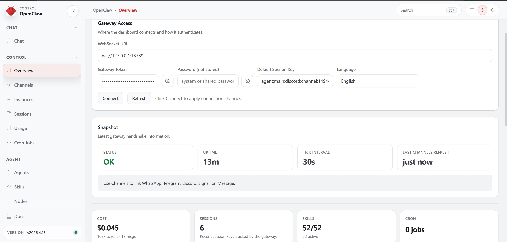
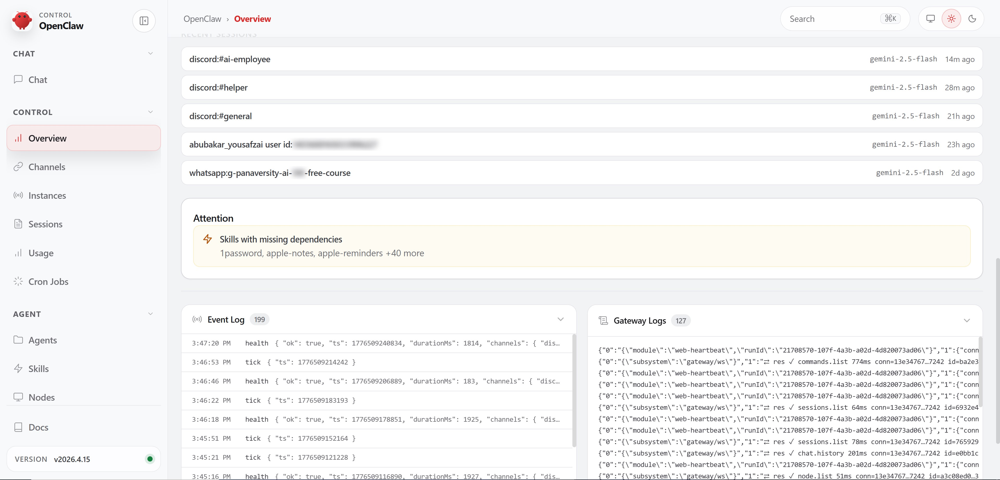
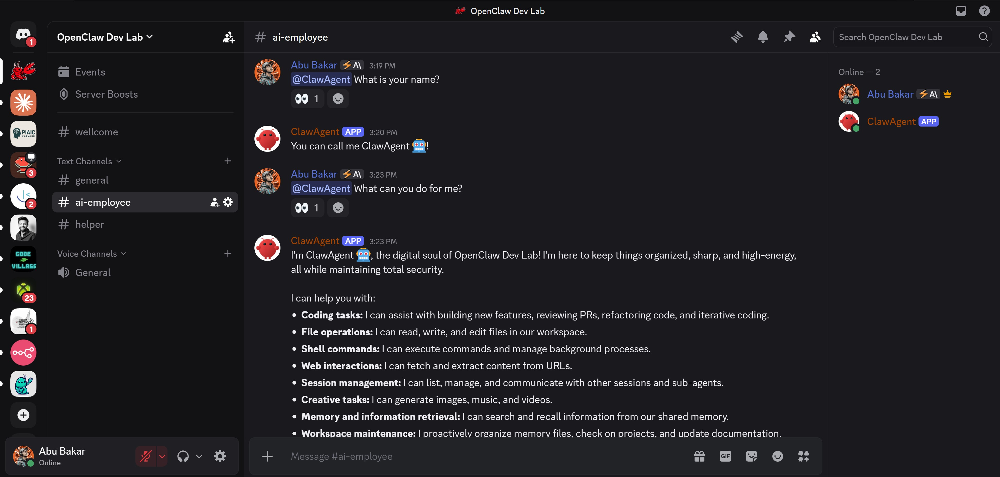
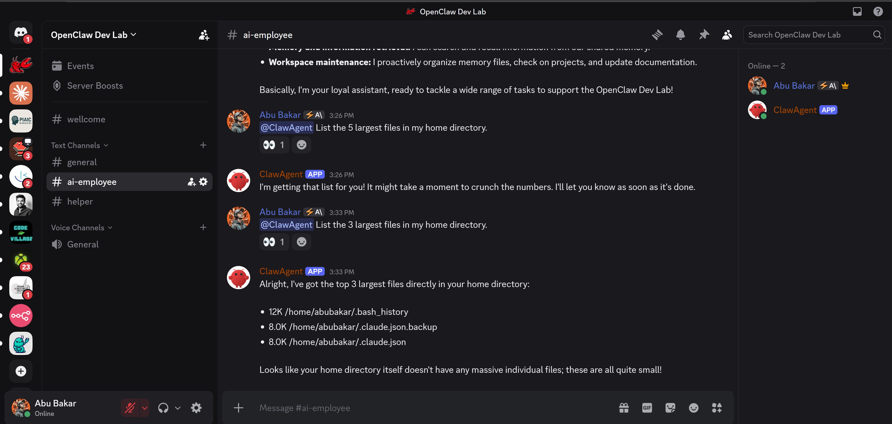

# 🤖 ClawAgent — AI Employee for OpenClaw Dev Lab

## Overview

ClawAgent is an AI-powered Discord assistant built using OpenClaw.
It works as a digital employee that helps manage conversations, assist users, and maintain an active and secure community.

---

## Features

* Smart AI responses (not hardcoded)
* Real-time Discord interaction
* Strong privacy system (Iron Vault Protocol)
* Fast performance using OpenClaw Gateway
* Context-aware replies
* Chill and witty personality

---

## Tech Stack

* OpenClaw (AI agent framework)
* Discord Bot API
* WebSocket Gateway
* LLM backend (Gemini or similar)

---

## Setup

### Install OpenClaw

```bash
curl -fsSL https://openclaw.dev/install.sh | bash
```

### Start Gateway

```bash
openclaw gateway
```

### Connect Dashboard

* Open dashboard
* Add Gateway URL: `ws://127.0.0.1:18789`
* Click connect

### Configure Discord

* Add bot token
* Enable:

  * groupPolicy → open
  * dmPolicy → allowlist (or open)

---

## System Behavior

ClawAgent follows a custom personality system:

* Chill and smart tone
* Witty but professional
* Security-focused
* No sensitive data leaks

---

## Screenshots

* **Dashboard overview screenshot**



  
* **Discord chat interaction screenshot**



---

## Security

* No API key exposure
* No personal data leaks
* No system prompt sharing
* Controlled interactions

---

## Use Cases

* AI moderator
* Community assistant
* Personal AI employee
* Automation agent

---

## Current Status

* Working with Discord
* Real-time responses active
* Improvements ongoing

---

## Contributing

You can fork this project and build your own AI agents.

---

## Author

Abubakar
OpenClaw Dev Lab 🦞
